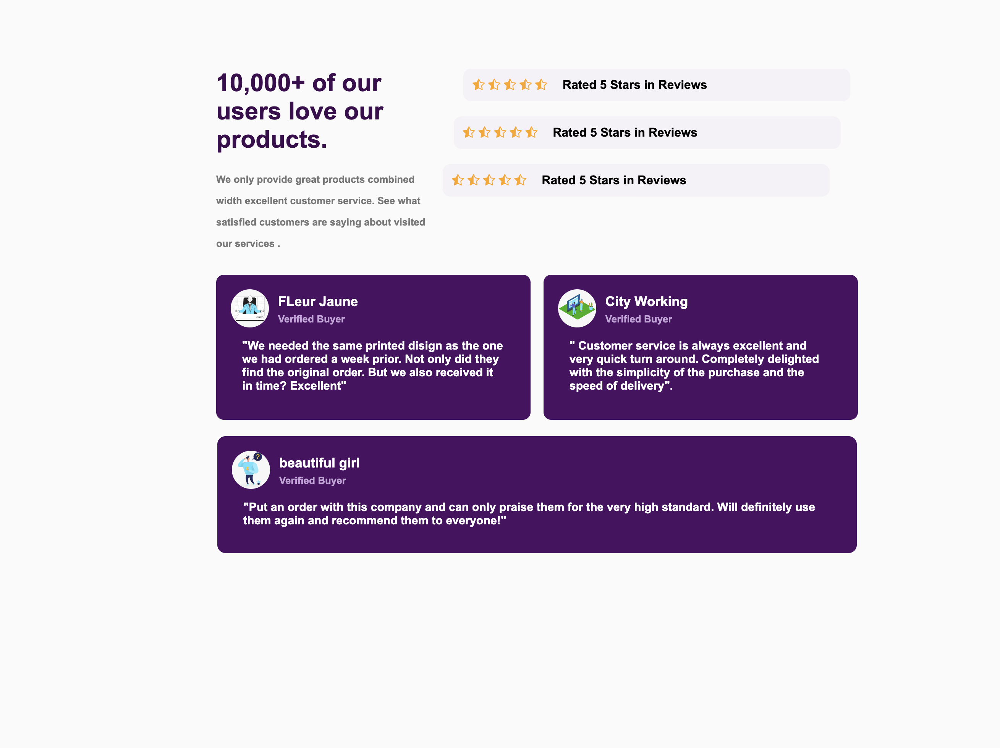

# Social Proof Section

## Description

Le projet Social Proof met en avant la puissance des témoignages clients pour renforcer la crédibilité d’un produit ou service.  
Il s’agit d’une section moderne, élégante et entièrement responsive, présentant :

- Un titre principal accrocheur et une brève description de la satisfaction client.  
- Des évaluations sous forme d’étoiles issues de différentes plateformes.  
- Des cartes de témoignages clients avec photo, nom, statut et avis personnalisé.

##  Objectifs 
- Comprendre l’importance de la preuve sociale dans le design web.

 - Structurer une page HTML en sections logiques (titre, avis, témoignages).

- Utiliser le CSS pour créer une interface moderne et responsive.

- Mettre en avant des témoignages clients de façon attractive.

- Travailler l’accessibilité (balises alt, structure sémantique)

- Développer ses compétences en intégration HTML & CSS.

- Apprendre à utiliser les icons

# Technologies utilisées

## HTML(structure sémantique)
## CSS(flexbox, media queries)
## Bootstrap Icons (pour les étoiles )

# Remarques personnelle
Ce projet m'a beaucoup appris surtout a approndir mes connaissances au niveau de la responsivité d'un site;
A bien structuré mon HTML et faire un Disign propre et responsive.

